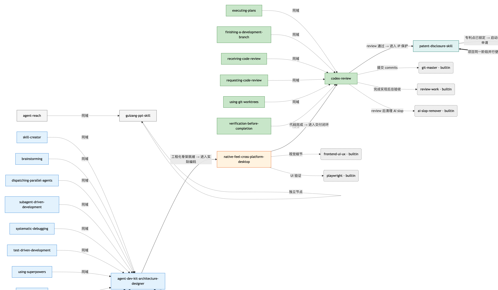

# OpenCode Skills 总目录

本文档统一管理 [`~/.config/opencode/skills/`](file:///Users/lute/.config/opencode/skills) 下的所有用户级 skill。

**用途**：作为「AI 数字人」长期使用时的能力地图。每次接到任务时，先来本目录定位**这个任务该激活哪些 skill 组合**，然后通过 `skill(name="...")` 或 `task(load_skills=[...], ...)` 加载。

**维护原则**：

- 每安装一个新 skill，**先**追加到下方"分类清单"对应域，**再**更新「skills graph」关联。
- 每个 skill 必须填齐：定位、触发场景、依赖、协作伙伴。
- 不要写虚的功能列表 —— 每条记录都要能直接回答「这个 skill 解决什么具体问题、什么时候不用它」。

---

## 一、分类管理（按使用场景域分组）

skills 按"什么场景下激活"分 6 个域。同一个 skill 不会同时出现在两个域里。

### 域 1 · AI 工程基础设施（Meta-Engineering）

**何时进入这个域**：你不是在写业务代码，而是在**设计/审计 AI agent 自身的工作环境** —— 仓库结构、agent 记忆、skill 库、hook、subagent、plugin。

| Skill | 定位 | 主要触发词 |
|---|---|---|
| [agent-dev-kit-architecture-designer](file:///Users/lute/.config/opencode/skills/agent-dev-kit-architecture-designer/SKILL.md) | 给 AI 编码 agent 设计仓库五层架构（Memory / Knowledge / Guardrail / Delegation / Distribution） | `CLAUDE.md`, skills, hooks, subagents, plugins, agent directory structure, agent guardrails, team-wide agent distribution |
| [skill-creator](file:///Users/lute/.config/opencode/skills/skill-creator/SKILL.md) | Create / modify / measure skills（含变异分析与触发准确率优化） | skill creation, skill creator, run evals, optimize description |
| [brainstorming](file:///Users/lute/.config/opencode/skills/brainstorming/SKILL.md) | 头脑风暴/发散 | brainstorm,ideation,divergent |
| [dispatching-parallel-agents](file:///Users/lute/.config/opencode/skills/dispatching-parallel-agents/SKILL.md) | 并行调度子代理 | parallel,subagent,dispatch |
| [subagent-driven-development](file:///Users/lute/.config/opencode/skills/subagent-driven-development/SKILL.md) | 子代理驱动开发 | subagent,delegation,parallel |
| [systematic-debugging](file:///Users/lute/.config/opencode/skills/systematic-debugging/SKILL.md) | 系统化调试方法论 | debug,systematic,hypothesis |
| [test-driven-development](file:///Users/lute/.config/opencode/skills/test-driven-development/SKILL.md) | 测试驱动开发 TDD | tdd,test-first,red-green-refactor |
| [using-superpowers](file:///Users/lute/.config/opencode/skills/using-superpowers/SKILL.md) | 使用 superpowers 入口 | superpowers,index,meta |
| [writing-plans](file:///Users/lute/.config/opencode/skills/writing-plans/SKILL.md) | 撰写工程计划 | plan,spec,decompose |
| [writing-skills](file:///Users/lute/.config/opencode/skills/writing-skills/SKILL.md) | 撰写 skill 文件 | skill,write,frontmatter |

> 这一域目前只有 1 个 skill，但它是**所有其他 skill 的"元结构"** —— 决定了你今后写 skill 时的目录约定、前置守卫、团队分发方式。新增任何"AI 工作流治理类" skill 时，先和它对照。

---

### 域 2 · 代码质量与交付闭环（Code Closeout）

**何时进入这个域**：代码已经写完，进入"提交 / PR / 发布"前的最后一公里。

| Skill | 定位 | 主要触发词 |
|---|---|---|
| [codex-review](file:///Users/lute/.config/opencode/skills/codex-review/SKILL.md) | 用 `codex review` 做提交前的二次审查（uncommitted / PR vs main / 并行测试） | `codex review`, autoreview, 二次审查, 提交前审查, ship/commit/PR 前的最后检查 |
| [executing-plans](file:///Users/lute/.config/opencode/skills/executing-plans/SKILL.md) | 按计划执行 | execute,plan,follow |
| [finishing-a-development-branch](file:///Users/lute/.config/opencode/skills/finishing-a-development-branch/SKILL.md) | 结束开发分支 | branch,finish,merge |
| [receiving-code-review](file:///Users/lute/.config/opencode/skills/receiving-code-review/SKILL.md) | 接收代码评审反馈 | code review,receive,respond |
| [requesting-code-review](file:///Users/lute/.config/opencode/skills/requesting-code-review/SKILL.md) | 发起代码评审请求 | code review,request,prepare |
| [using-git-worktrees](file:///Users/lute/.config/opencode/skills/using-git-worktrees/SKILL.md) | 使用 git worktree | worktree,git,parallel-branch |
| [verification-before-completion](file:///Users/lute/.config/opencode/skills/verification-before-completion/SKILL.md) | 完成前的验证 | verify,evidence,proof |

**运行时依赖**：

- `codex` CLI（已通过 brew 安装到 `/opt/homebrew/bin/codex`，0.130.0）
- 可选 helper：[`scripts/codex-review`](file:///Users/lute/.config/opencode/skills/codex-review/scripts/codex-review)（自动选 mode + 并行 tests）

> 这一域专门承接"已有非平凡代码改动，准备 ship"的场景。**绝不**在写代码过程中触发。

---

### 域 3 · 桌面应用工程（Desktop Native Feel）

**何时进入这个域**：在做**跨平台桌面应用**，并且**用户体感必须像原生**（启动快、窗口逻辑原生、输入响应原生、材质原生）。

| Skill | 定位 | 主要触发词 |
|---|---|---|
| [native-feel-cross-platform-desktop](file:///Users/lute/.config/opencode/skills/native-feel-cross-platform-desktop/SKILL.md) | Raycast 2.0 重写公开技术 + 逆向 `Raycast Beta.app` 提炼出的八大架构原则、四层架构、WebKit/WebView2 生存指南、75 项 ship 前自检清单 | `cross-platform desktop`, `Electron alternative`, `Tauri vs native`, `WebView wrapper`, `WKWebView`, `Raycast architecture`, `WebKit/WebView2 quirks`, `system tray app`, `global hotkey app`, `launcher app` |

**资源**（按需加载，不要一次全读）：

- 哲学层：[`references/01-philosophy.md`](file:///Users/lute/.config/opencode/skills/native-feel-cross-platform-desktop/references/01-philosophy.md)
- 架构层：[`references/02-architecture.md`](file:///Users/lute/.config/opencode/skills/native-feel-cross-platform-desktop/references/02-architecture.md)
- WebView 救命：[`references/03-webview-survival.md`](file:///Users/lute/.config/opencode/skills/native-feel-cross-platform-desktop/references/03-webview-survival.md)
- IPC 契约：[`references/04-ipc-contract.md`](file:///Users/lute/.config/opencode/skills/native-feel-cross-platform-desktop/references/04-ipc-contract.md)
- 内存事实：[`references/05-memory-truths.md`](file:///Users/lute/.config/opencode/skills/native-feel-cross-platform-desktop/references/05-memory-truths.md)
- 原生约定：[`references/06-native-conventions.md`](file:///Users/lute/.config/opencode/skills/native-feel-cross-platform-desktop/references/06-native-conventions.md)
- Raycast 证据：[`references/07-evidence-raycast.md`](file:///Users/lute/.config/opencode/skills/native-feel-cross-platform-desktop/references/07-evidence-raycast.md)
- 决策树：[`checklists/decision-tree.md`](file:///Users/lute/.config/opencode/skills/native-feel-cross-platform-desktop/checklists/decision-tree.md)
- Ship 自检：[`checklists/ship-readiness.md`](file:///Users/lute/.config/opencode/skills/native-feel-cross-platform-desktop/checklists/ship-readiness.md)

> **不要**在纯 web 应用 / 纯移动应用 / 没有"原生体感"硬性需求的项目里触发本 skill。

---

### 域 4 · 创业与产品验证（Founder / Product）

**何时进入这个域**：手上有一个**点子**，需要在写一行代码之前判断"这事儿值不值得做"。

| Skill | 定位 | 主要触发词 |
|---|---|---|
| [startup-pressure-test](file:///Users/lute/.config/opencode/skills/startup-pressure-test/SKILL.md) | 用 Paul Graham 早期创业框架对点子做"残酷压力测试"：问题真不真、ICP、首批 10 个客户、MVP、2 周 launch 计划、founder-market fit、强/弱/转向的直接判决 | pressure-test startup idea, validate problem, ICP, first 10 customers, MVP, 2-week launch plan, founder-market fit, strong/weak/pivot verdict |

**资源**：[`references/playbooks.md`](file:///Users/lute/.config/opencode/skills/startup-pressure-test/references/playbooks.md)

> **语言匹配**：用户用中文/意大利文/英文提问，回复就用同一种。

---

### 域 5 · 知识产权交付（IP Deliverables · 强耦合双子星）

**何时进入这个域**：项目进入**商业化保护阶段**，要把代码资产变成可申报的法律文件。

| Skill | 定位 | 输出物 |
|---|---|---|
| [patent-disclosure-skill](file:///Users/lute/.config/opencode/skills/patent-disclosure-skill/SKILL.md) | 从代码 / 设计文档挖掘专利点 → 国知局公布站查新 → 脱敏成稿 → 自检闭环 → 出 `.docx` 技术交底书 | `{案件名}_{时间戳}.md` + `.docx` 技术交底书 |
| [software-copyright-materials](file:///Users/lute/.config/opencode/skills/software-copyright-materials/SKILL.md) | 从真实代码生成中国软著申请全套：业务理解 → 申请表 → 60 页代码材料（前/后 30 页拆分） → 操作手册 → 多轮自检 | `软件著作权申请资料/正式资料/` 下的 `.docx` + `.txt` 全套 |

**这两个 skill 强耦合**：

- 都从**真实项目源码**起步（不允许 AI 编造代码）。
- 都强制**人工门禁**（用户必须确认每个关键阶段才能继续）。
- 都用**带时间戳的多版本输出**，支持迭代。
- **同一个项目商业化时常常一起做**：先专利挖掘（保护核心创新），再软著申请（保护代码本体）。

**运行时依赖**（已全部就位）：

| 依赖 | 用途 | 安装位置 |
|---|---|---|
| Python 3.9 + `python-docx` / `mammoth` / `python-pptx` / `lxml` / `Pillow` / `XlsxWriter` | 两个 skill 的基础文档转换 | `~/Library/Python/3.9/lib/python/site-packages` |
| `playwright` 1.59 + Chromium | 专利国知局查新 | `~/Library/Caches/ms-playwright/` |
| `@mermaid-js/mermaid-cli` (mmdc) 11.12.0 + puppeteer | 专利交底书的系统框图渲染 | [`patent-disclosure-skill/tools/node_modules`](file:///Users/lute/.config/opencode/skills/patent-disclosure-skill/tools/node_modules) |
| .NET SDK 8.0.421 + DocxToolkit.Cli (built) | 软著的完整 OpenXML Word 生成 | `~/.dotnet/` + [`software-copyright-materials/vendor/docx-toolkit/scripts/dotnet/`](file:///Users/lute/.config/opencode/skills/software-copyright-materials/vendor/docx-toolkit/scripts/dotnet) |

> .NET 不装也能用 —— 软著 skill 自带 DOCX 兜底路径，会在 `check_environment.py` 阶段问你选完整模式还是兜底模式。

---

### 域 6 · 工具增强（横切层 · cross-cutting）

**何时进入这个域**：不绑定特定项目类型，但**任何项目都可能需要**的能力。

| Skill | 定位 | 主要触发词 |
|---|---|---|
| [guizang-ppt-skill](file:///Users/lute/.config/opencode/skills/guizang-ppt-skill/SKILL.md) | 网页 PPT 生成（HTML deck + 配图 + 多平台封面） | PPT, slide deck, 瑞士风, image prompts, social cover |
| [agent-reach](file:///Users/lute/.config/opencode/skills/agent-reach/SKILL.md) | 给 agent 装互联网读写能力（17 平台） | twitter,reddit,youtube,github,xiaohongshu,bilibili,weibo,搜索,网页,rss |

---

## 二、Skills Graph（关联关系层）

下面是 skills 之间的**协作图**。箭头方向 = "谁通常先于谁"或"谁的输出喂给谁"。同色 = 同一域。

**渲染好的 PNG**（4792×1058）：[`skills-graph.png`](file:///Users/lute/.config/opencode/skills/skills-graph.png)
**Mermaid 源码**（独立文件，方便修改后重渲）：[`skills-graph.mmd`](file:///Users/lute/.config/opencode/skills/skills-graph.mmd)



> **重渲方法**：编辑 `skills-graph.mmd`（或修改下方代码块后用 `awk '/^\`\`\`mermaid$/,/^\`\`\`$/' INDEX.md > skills-graph.mmd` 同步），然后跑：
> ```bash
> python3 ~/.config/opencode/skills/render-mermaid.py \
>   ~/.config/opencode/skills/skills-graph.mmd \
>   ~/.config/opencode/skills/skills-graph.png
> ```
> 渲染脚本 [`render-mermaid.py`](file:///Users/lute/.config/opencode/skills/render-mermaid.py) 依赖 [`playwright + chromium-1217`](file:///Users/lute/Library/Caches/ms-playwright/chromium-1217)（已在 patent-disclosure 安装时装好）。
>
> **不要用 mmdc 直接渲染**：本机环境（macOS arm64_tahoe + Chrome 147）下 mmdc 11.4 + 内嵌 puppeteer 会报 `failed to find element matching selector "#container"`，已在 2026-05-14 验证。playwright + jsdelivr CDN 是已验证可用的替代方案。

```mermaid
flowchart LR
    %% Class definitions for color coding
    classDef metaDomain fill:#e3f2fd,stroke:#1976d2,color:#000
    classDef closeoutDomain fill:#c8e6c9,stroke:#2e7d32,color:#000
    classDef desktopDomain fill:#fff3e0,stroke:#e65100,color:#000
    classDef founderDomain fill:#f3e5f5,stroke:#6a1b9a,color:#000
    classDef ipDomain fill:#e0f2f1,stroke:#00695c,color:#000
    classDef builtin fill:#eeeeee,stroke:#616161,color:#000,stroke-dasharray: 4 2

    %% Domain 1 - Meta
    ADK[agent-dev-kit-architecture-designer]:::metaDomain

    %% Domain 2 - Closeout
    CR[codex-review]:::closeoutDomain

    %% Domain 3 - Desktop
    NF[native-feel-cross-platform-desktop]:::desktopDomain

    %% Domain 4 - Founder
    SPT[startup-pressure-test]:::founderDomain

    %% Domain 5 - IP
    PAT[patent-disclosure-skill]:::ipDomain
    SCS[software-copyright-materials]:::ipDomain

    %% Domain 6 - Builtin (referenced for context)
    GM(git-master · builtin):::builtin
    RW(review-work · builtin):::builtin
    ASR(ai-slop-remover · builtin):::builtin
    FE(frontend-ui-ux · builtin):::builtin
    PW(playwright · builtin):::builtin

    %% --- Lifecycle flows ---

    %% Founder lifecycle: idea -> meta-design -> code -> review -> ship -> IP
    SPT -- "idea 通过压力测试 → 进入工程化" --> ADK
    ADK -- "工程化骨架就绪 → 进入实际编码" --> NF
    NF -- "代码完成 → 进入交付闭环" --> CR
    CR -- "review 通过 → 进入 IP 保护" --> PAT
    PAT -- "专利点已锁定 → 启动软著申请" --> SCS

    %% --- Cross-domain reinforcements ---

    %% Desktop work strongly benefits from playwright (UI verification) + frontend-ui-ux
    NF -. "UI 验证" .-> PW
    NF -. "视觉细节" .-> FE

    %% Closeout chains
    CR -. "提交 commits" .-> GM
    CR -. "review 后清理 AI slop" .-> ASR
    CR -. "完成实现后总验收" .-> RW

    %% Meta-engineering applies recursively
    ADK -. "用本架构反思 skills 自身" .-> ADK

    %% IP duo internal coupling
    PAT <==> |"项目同一阶段并行使用"| SCS
```



**关键关联规则**（图里的边背后的含义）：

| 关联 | 类型 | 说明 |
|---|---|---|
| `startup-pressure-test → agent-dev-kit-architecture-designer` | 生命周期顺序 | 点子被压测通过后，才值得花时间搭 agent 工程基础设施。绝不要在点子还没验证前就建 5 层架构。 |
| `agent-dev-kit-architecture-designer → native-feel-cross-platform-desktop` | 工程化路径 | agent 仓库就绪后，如果要做的就是桌面应用，进入桌面工程域。 |
| `native-feel-cross-platform-desktop → codex-review` | 闭环 | 代码完成后必经的二次审查门。 |
| `codex-review → patent-disclosure-skill` | 商业化转交 | review 干净 + 代码稳定 = 可以开始挖专利点。早于这一步挖容易写错最终接口。 |
| `patent-disclosure-skill ⇄ software-copyright-materials` | 强耦合并行 | 同一项目同一商业化阶段同时做，前者保护"创新点"，后者保护"代码本体"。 |
| `native-feel-* ⇢ playwright / frontend-ui-ux` | 增援 | 桌面 UI 工作的实际验证手段。playwright 用来"驱动真实浏览器/WebView"，frontend-ui-ux 用来"判设计细节"。 |
| `codex-review ⇢ git-master / ai-slop-remover / review-work` | 增援 | review 后的提交、清理、总验收都靠这三个内置 skill。 |
| `agent-dev-kit-* ↺ self` | 元递归 | 该 skill 也用于反思 skill 库自身的结构 —— 比如这份 INDEX.md 就是 ADK 第一层 Memory 的产物。 |

---

## 三、典型场景套餐（数字人快速选型）

以下是常见场景下"该一次性加载哪几个 skill"的速查表。直接拿去用。

| 场景 | 加载组合 (`load_skills=[...]`) | 备注 |
|---|---|---|
| 「我有个新点子，先看看靠不靠谱」 | `["startup-pressure-test"]` | 单 skill，**不要**马上加 ADK。 |
| 「准备搭一个跨平台桌面 app 的脚手架」 | `["agent-dev-kit-architecture-designer", "native-feel-cross-platform-desktop"]` | ADK 给工程结构，NF 给桌面架构原则。 |
| 「PR 准备 ship 之前」 | `["codex-review", "git-master", "review-work"]` | 三件套：审查 → 提交 → 总验收。 |
| 「这个项目要申请软著 + 挖专利」 | `["patent-disclosure-skill", "software-copyright-materials"]` | IP 双子星必须一起加，避免软件名/版本号在两个流程里漂移。 |
| 「给现有 OpenCode 仓库做架构审计」 | `["agent-dev-kit-architecture-designer"]` | 单 skill，让它输出五层架构 gap 分析。 |
| 「我的 Electron 应用启动慢/窗口卡，到底怎么救」 | `["native-feel-cross-platform-desktop", "playwright"]` | NF 出诊断方向，playwright 验证 fix。 |

---

## 四、维护变更日志

| 日期 | 变更 | 操作人 |
|---|---|---|
| 2026-05-14 | 初版建立。包含 6 个 skill：`agent-dev-kit-architecture-designer`, `codex-review`, `native-feel-cross-platform-desktop`, `patent-disclosure-skill`, `software-copyright-materials`, `startup-pressure-test` | 初始化 |
| 2026-05-14 | 新增渲染脚本 [`render-mermaid.py`](file:///Users/lute/.config/opencode/skills/render-mermaid.py) 和 [`skills-graph.png`](file:///Users/lute/.config/opencode/skills/skills-graph.png)（4792×1058 PNG）。mmdc 在 Chrome 147 下不工作，改用 playwright + jsdelivr CDN 方案 | 渲染管线落地 |

> **新增/更新规则**：每装一个 skill 必须 (1) 选定所属域 (2) 在分类清单里追加一行 (3) 在 mermaid graph 里加节点 + 至少一条与已有 skill 的关联边 (4) 在变更日志加一行。
