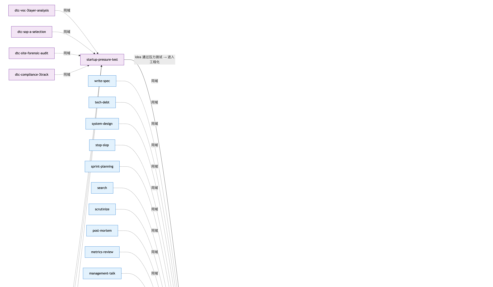

# OpenCode Skills 总目录

本文档统一管理 [`~/.config/opencode/skills/`](file:///Users/lute/.config/opencode/skills) 下的所有用户级 skill。

**用途**：作为「AI 数字人」长期使用时的能力地图。每次接到任务时，先来本目录定位**这个任务该激活哪些 skill 组合**，然后通过 `skill(name="...")` 或 `task(load_skills=[...], ...)` 加载。

**维护原则**：

- 每安装一个新 skill，**先**追加到下方"分类清单"对应域，**再**更新「skills graph」关联。
- 每个 skill 必须填齐：定位、触发场景、依赖、协作伙伴。
- 不要写虚的功能列表 —— 每条记录都要能直接回答「这个 skill 解决什么具体问题、什么时候不用它」。

---

## 一、分类管理（按使用场景域分组）

skills 按"什么场景下激活"分 6 个域。同一个 skill 不会同时出现在两个域里。

### 域 1 · AI 工程基础设施（Meta-Engineering）

**何时进入这个域**：你不是在写业务代码，而是在**设计/审计 AI agent 自身的工作环境** —— 仓库结构、agent 记忆、skill 库、hook、subagent、plugin。

| Skill | 定位 | 主要触发词 |
|---|---|---|
| [agent-dev-kit-architecture-designer](file:///Users/lute/.config/opencode/skills/agent-dev-kit-architecture-designer/SKILL.md) | 给 AI 编码 agent 设计仓库五层架构（Memory / Knowledge / Guardrail / Delegation / Distribution） | `CLAUDE.md`, skills, hooks, subagents, plugins, agent directory structure, agent guardrails, team-wide agent distribution |
| [skill-creator](file:///Users/lute/.config/opencode/skills/skill-creator/SKILL.md) | Create / modify / measure skills（含变异分析与触发准确率优化） | skill creation, skill creator, run evals, optimize description |
| [brainstorming](file:///Users/lute/.config/opencode/skills/brainstorming/SKILL.md) | 头脑风暴/发散 | brainstorm,ideation,divergent |
| [dispatching-parallel-agents](file:///Users/lute/.config/opencode/skills/dispatching-parallel-agents/SKILL.md) | 并行调度子代理 | parallel,subagent,dispatch |
| [subagent-driven-development](file:///Users/lute/.config/opencode/skills/subagent-driven-development/SKILL.md) | 子代理驱动开发 | subagent,delegation,parallel |
| [systematic-debugging](file:///Users/lute/.config/opencode/skills/systematic-debugging/SKILL.md) | 系统化调试方法论 | debug,systematic,hypothesis |
| [test-driven-development](file:///Users/lute/.config/opencode/skills/test-driven-development/SKILL.md) | 测试驱动开发 TDD | tdd,test-first,red-green-refactor |
| [using-superpowers](file:///Users/lute/.config/opencode/skills/using-superpowers/SKILL.md) | 使用 superpowers 入口 | superpowers,index,meta |
| [writing-plans](file:///Users/lute/.config/opencode/skills/writing-plans/SKILL.md) | 撰写工程计划 | plan,spec,decompose |
| [writing-skills](file:///Users/lute/.config/opencode/skills/writing-skills/SKILL.md) | 撰写 skill 文件 | skill,write,frontmatter |
| [autoplan](file:///Users/lute/.config/opencode/skills/autoplan/SKILL.md) | 一键跑完 4 个 plan review | autoplan,plan review,CEO,eng,design,DX |
| [investigate](file:///Users/lute/.config/opencode/skills/investigate/SKILL.md) | 系统化调试 + 根因分析 | investigate,root cause,debug,Iron Law |
| [office-hours](file:///Users/lute/.config/opencode/skills/office-hours/SKILL.md) | YC Office Hours（6 forcing questions） | office hours,YC,founder,demand,desperation |
| [plan-ceo-review](file:///Users/lute/.config/opencode/skills/plan-ceo-review/SKILL.md) | 创始人视角评审 plan（10-star 产品） | plan review,CEO,founder mode,10-star |
| [plan-eng-review](file:///Users/lute/.config/opencode/skills/plan-eng-review/SKILL.md) | 工程经理视角评审 plan（架构、测试） | plan review,eng manager,architecture,test |
| [plan-design-review](file:///Users/lute/.config/opencode/skills/plan-design-review/SKILL.md) | 设计师视角评审 plan（0-10 评分） | plan review,design,visual,UX |
| [plan-devex-review](file:///Users/lute/.config/opencode/skills/plan-devex-review/SKILL.md) | 开发体验视角评审 plan | plan review,DX,developer experience |
| [plan-tune](file:///Users/lute/.config/opencode/skills/plan-tune/SKILL.md) | plan 系统自调优 + 用户心理画像 | plan tune,psychographic,question sensitivity |
| [qa](file:///Users/lute/.config/opencode/skills/qa/SKILL.md) | 自动 QA 测试 + 迭代修 bug | QA,bug fix,web app testing,iterate |
| [qa-only](file:///Users/lute/.config/opencode/skills/qa-only/SKILL.md) | 只测不修，出 QA 报告 | QA report,health score,screenshot |
| [context-save](file:///Users/lute/.config/opencode/skills/context-save/SKILL.md) | 保存工作上下文（git + 决策 + 未完） | context save,session,handoff,git state |
| [context-restore](file:///Users/lute/.config/opencode/skills/context-restore/SKILL.md) | 恢复之前保存的工作上下文 | context restore,resume session,last branch |
| [diagnose](file:///Users/lute/.config/opencode/skills/diagnose/SKILL.md) | Disciplined bug/perf diagnosis loop — reproduce → minimise → hypothesise → instrument → fix → regression-test | diagnose this, debug this, something is broken, performance regression |
| [grill-with-docs](file:///Users/lute/.config/opencode/skills/grill-with-docs/SKILL.md) | Stress-test a plan against domain model and docs, sharpen terminology, update CONTEXT.md/ADRs inline | stress-test plan against docs, challenge my design, sharpen terminology |
| [improve-codebase-architecture](file:///Users/lute/.config/opencode/skills/improve-codebase-architecture/SKILL.md) | Surface architectural friction and deepening opportunities — testability, AI-navigability, module cohesion | improve architecture, find refactoring, make codebase AI-navigable |
| [to-issues](file:///Users/lute/.config/opencode/skills/to-issues/SKILL.md) | Break plan/spec/PRD into independently-grabbable vertical-slice issues on the project tracker | convert plan to issues, create implementation tickets, break down work |
| [to-prd](file:///Users/lute/.config/opencode/skills/to-prd/SKILL.md) | Synthesize conversation context into a PRD and publish to the issue tracker | create PRD from context, turn conversation into PRD |
| [triage](file:///Users/lute/.config/opencode/skills/triage/SKILL.md) | State-machine triage of issues through roles: clarify, estimate, prioritize, assign | create issue, triage bugs, review incoming feature requests, manage issue workflow |
| [zoom-out](file:///Users/lute/.config/opencode/skills/zoom-out/SKILL.md) | Map all relevant modules and callers using project domain glossary for unfamiliar code areas | zoom out, unfamiliar with code, bigger picture, how does this fit |
| [caveman](file:///Users/lute/.config/opencode/skills/caveman/SKILL.md) | Ultra-compressed ~75% token-saving mode — full technical accuracy, zero filler | caveman mode, less tokens, be brief, talk like caveman |
| [grill-me](file:///Users/lute/.config/opencode/skills/grill-me/SKILL.md) | Relentless interview on a plan/design until shared understanding, resolving decision-tree branches | grill me, stress-test my plan, interview me on design |
| [handoff](file:///Users/lute/.config/opencode/skills/handoff/SKILL.md) | Compact current conversation into a handoff doc for a fresh agent to continue work | handoff, create handoff doc, pass to next agent |
| [debug-mantra](file:///Users/lute/.config/opencode/skills/debug-mantra/SKILL.md) | 🆕 Structured debugging mantra — systematic approach to root cause, from 9arm-skills | debug mantra, debugging discipline, root cause |
| [scrutinize](file:///Users/lute/.config/opencode/skills/scrutinize/SKILL.md) | 🆕 Deep code scrutiny for correctness, edge cases, and hidden assumptions | scrutinize code, code correctness, edge case analysis |
| [post-mortem](file:///Users/lute/.config/opencode/skills/post-mortem/SKILL.md) | 🆕 Structured post-mortem: 5-whys, timeline, action items, from 9arm-skills | post-mortem, incident review, 5-whys, retrospective |
| [management-talk](file:///Users/lute/.config/opencode/skills/management-talk/SKILL.md) | 🆕 Translate technical work into business language for stakeholders | management communication, stakeholder update, progress report |
| [academic-paper](file:///Users/lute/.config/opencode/skills/academic-paper/SKILL.md) | 🆕 12-agent academic paper pipeline: research → write → review → revise → finalize | academic paper, research writing, literature review |
| [academic-paper-reviewer](file:///Users/lute/.config/opencode/skills/academic-paper-reviewer/SKILL.md) | 🆕 Peer review simulation for academic papers | academic paper review, peer review, paper critique |
| [academic-pipeline](file:///Users/lute/.config/opencode/skills/academic-pipeline/SKILL.md) | 🆕 End-to-end research publication pipeline orchestration | academic pipeline, research workflow, publication |
| [deep-research](file:///Users/lute/.config/opencode/skills/deep-research/SKILL.md) | 🆕 Universal deep research: multi-source synthesis, evidence grounding | deep research, multi-source, evidence-based research |
| [stop-slop](file:///Users/lute/.config/opencode/skills/stop-slop/SKILL.md) | 🆕 Remove AI writing tells, structural clichés, overused phrases | stop slop, AI writing cleanup, prose quality, anti-generic |
| [architecture](file:///Users/lute/.config/opencode/skills/architecture/SKILL.md) | 🆕 Anthropic kw-plugins: architecture review and design decisions | architecture review, system architecture, tech decisions |
| [debug](file:///Users/lute/.config/opencode/skills/debug/SKILL.md) | 🆕 Anthropic kw-plugins: structured debugging workflow | debug workflow, structured debugging, bug investigation |
| [system-design](file:///Users/lute/.config/opencode/skills/system-design/SKILL.md) | 🆕 Anthropic kw-plugins: system design documentation | system design, scalability, design doc, distributed systems |
| [tech-debt](file:///Users/lute/.config/opencode/skills/tech-debt/SKILL.md) | 🆕 Anthropic kw-plugins: tech debt identification and prioritization | tech debt, refactoring priority, code quality |
| [incident-response](file:///Users/lute/.config/opencode/skills/incident-response/SKILL.md) | 🆕 Anthropic kw-plugins: incident response and coordination | incident response, outage, production issue, on-call |
| [write-spec](file:///Users/lute/.config/opencode/skills/write-spec/SKILL.md) | 🆕 Anthropic kw-plugins: engineering specs and technical requirements | write spec, technical spec, RFC, requirements |
| [sprint-planning](file:///Users/lute/.config/opencode/skills/sprint-planning/SKILL.md) | 🆕 Anthropic kw-plugins: sprint planning and story estimation | sprint planning, story points, backlog grooming |
| [metrics-review](file:///Users/lute/.config/opencode/skills/metrics-review/SKILL.md) | 🆕 Anthropic kw-plugins: product metrics review and OKR analysis | metrics review, KPI, product metrics, OKR |
| [knowledge-synthesis](file:///Users/lute/.config/opencode/skills/knowledge-synthesis/SKILL.md) | 🆕 Anthropic kw-plugins: synthesize info from multiple sources | knowledge synthesis, research synthesis, multi-source |
| [search](file:///Users/lute/.config/opencode/skills/search/SKILL.md) | 🆕 Anthropic kw-plugins: enterprise search strategy | enterprise search, knowledge base search, search strategy |
| [code-review](file:///Users/lute/.config/opencode/skills/code-review/SKILL.md) | 🆕 Anthropic kw-plugins: structured code review for engineering teams | code review workflow, PR review, engineering review |
| [analyzing-threat-actor-ttps-with-mitre-attack](file:///Users/lute/.config/opencode/skills/analyzing-threat-actor-ttps-with-mitre-attack/SKILL.md) | 🆕 MITRE ATT&CK TTP analysis — maps adversary behavior to framework | threat analysis, MITRE ATT&CK, TTP, threat intel |
| [implementing-honeypot-for-ransomware-detection](file:///Users/lute/.config/opencode/skills/implementing-honeypot-for-ransomware-detection/SKILL.md) | 🆕 Honeypot implementation for ransomware early detection | honeypot, ransomware detection, deception security |
| [codegraph-add-lang](file:///Users/lute/.config/opencode/skills/codegraph-add-lang/SKILL.md) | CodeGraph language support implementation SOP | /add-lang, tree-sitter, codegraph |
| [codegraph-agent-eval](file:///Users/lute/.config/opencode/skills/codegraph-agent-eval/SKILL.md) | CodeGraph retrieval benchmark SOP | /agent-eval, benchmark, codegraph |
| [paper-skills-gap-analysis](file:///Users/lute/.config/opencode/skills/paper-skills-gap-analysis/SKILL.md) | Skills graph coverage gap analysis SOP | skills graph 缺口, 推荐新选题方向, Sprint 选题 |
| [paper2skills-workflow](file:///Users/lute/.config/opencode/skills/paper2skills-workflow/SKILL.md) | paper2skills 端到端生产工作流 | 选题, 萃取论文, 新增 Skill, 完整流程 |
| [context-engineering](file:///Users/lute/.config/opencode/skills/context-engineering/SKILL.md) | Agent 上下文工程 | CLAUDE.md, context, rules files |
| [source-driven-development](file:///Users/lute/.config/opencode/skills/source-driven-development/SKILL.md) | 官方文档驱动实现 | official docs, source-cited, framework correctness |
| [spec-driven-development](file:///Users/lute/.config/opencode/skills/spec-driven-development/SKILL.md) | 先规格后实现 | spec, requirements, plan, tasks |
| [api-and-interface-design](file:///Users/lute/.config/opencode/skills/api-and-interface-design/SKILL.md) | API/模块接口设计 | REST, GraphQL, type contracts, boundaries |
| [planning-with-files](file:///Users/lute/.config/opencode/skills/planning-with-files/SKILL.md) | 长任务持久化计划与上下文恢复 | plan out, break down, context recovery |
| [agnix](file:///Users/lute/.config/opencode/skills/agnix/SKILL.md) | Agent/skill/hooks/MCP 配置 lint | lint agent configs, validate skills, lint MCP |
| [interview-me](file:///Users/lute/.config/opencode/skills/interview-me/SKILL.md) | 一问一答澄清真实意图 | interview me, clarify requirements, one question at a time |
| [idea-refine](file:///Users/lute/.config/opencode/skills/idea-refine/SKILL.md) | 把原始想法打磨成可执行概念 | refine idea, ideation, sharpen concept |
| [planning-and-task-breakdown](file:///Users/lute/.config/opencode/skills/planning-and-task-breakdown/SKILL.md) | 把规格拆成有依赖顺序的可验收任务 | task breakdown, implementation plan, ordered tasks |
| [incremental-implementation](file:///Users/lute/.config/opencode/skills/incremental-implementation/SKILL.md) | 用薄切片增量交付多文件改动 | incremental implementation, vertical slice, multi-file change |
| [doubt-driven-development](file:///Users/lute/.config/opencode/skills/doubt-driven-development/SKILL.md) | 用新上下文质疑高风险决策 | doubt, adversarial review, high-stakes decision |
| [using-agent-skills](file:///Users/lute/.config/opencode/skills/using-agent-skills/SKILL.md) | Addy agent-skills 套件路由入口 | agent skills, skill routing, use skills |
| [huashu-nuwa](file:///Users/lute/.config/opencode/skills/huashu-nuwa/SKILL.md) | Distill people, operating models, and decision patterns into runnable skills. | 07-agent-ops / agentops.skill-generation-optimization |
| [darwin-skill](file:///Users/lute/.config/opencode/skills/darwin-skill/SKILL.md) | Evaluate, improve, test, keep, or roll back skills through an optimization loop. | 07-agent-ops / agentops.skill-generation-optimization |
| [freud-skill](file:///Users/lute/.config/opencode/skills/freud-skill/SKILL.md) | Diagnose and tune prompts, skills, and agents through cognitive and interpretability frames. | 05-quality-review / quality.anti-ai-slop-review |
| [huashu-agent-swarm](file:///Users/lute/.config/opencode/skills/huashu-agent-swarm/SKILL.md) | Coordinate multiple agents for content and production workflows. | 07-agent-ops / agentops.skill-generation-optimization |

> 这一域目前只有 1 个 skill，但它是**所有其他 skill 的"元结构"** —— 决定了你今后写 skill 时的目录约定、前置守卫、团队分发方式。新增任何"AI 工作流治理类" skill 时，先和它对照。

---

### 域 2 · 代码质量与交付闭环（Code Closeout）

**何时进入这个域**：代码已经写完，进入"提交 / PR / 发布"前的最后一公里。

| Skill | 定位 | 主要触发词 |
|---|---|---|
| [codex-review](file:///Users/lute/.config/opencode/skills/codex-review/SKILL.md) | 用 `codex review` 做提交前的二次审查（uncommitted / PR vs main / 并行测试） | `codex review`, autoreview, 二次审查, 提交前审查, ship/commit/PR 前的最后检查 |
| [executing-plans](file:///Users/lute/.config/opencode/skills/executing-plans/SKILL.md) | 按计划执行 | execute,plan,follow |
| [finishing-a-development-branch](file:///Users/lute/.config/opencode/skills/finishing-a-development-branch/SKILL.md) | 结束开发分支 | branch,finish,merge |
| [receiving-code-review](file:///Users/lute/.config/opencode/skills/receiving-code-review/SKILL.md) | 接收代码评审反馈 | code review,receive,respond |
| [requesting-code-review](file:///Users/lute/.config/opencode/skills/requesting-code-review/SKILL.md) | 发起代码评审请求 | code review,request,prepare |
| [using-git-worktrees](file:///Users/lute/.config/opencode/skills/using-git-worktrees/SKILL.md) | 使用 git worktree | worktree,git,parallel-branch |
| [verification-before-completion](file:///Users/lute/.config/opencode/skills/verification-before-completion/SKILL.md) | 完成前的验证 | verify,evidence,proof |
| [land-and-deploy](file:///Users/lute/.config/opencode/skills/land-and-deploy/SKILL.md) | merge PR + 等 CI + 部署 + canary 验证 | land,deploy,merge PR,canary,CI |
| [release-readiness-hardening](file:///Users/lute/.config/opencode/skills/release-readiness-hardening/SKILL.md) | 安全发布门控：环境验证、部署检查、冒烟测试、回滚路径、功能开关 | release gates, deploy checklist, smoke tests, rollback, feature flags |
| [test-strategy-hardening](file:///Users/lute/.config/opencode/skills/test-strategy-hardening/SKILL.md) | 审计并强化测试套件，确保测试真正覆盖关键行为而非装饰性断言 | test strategy, flaky tests, contract tests, coverage, regression, e2e |
| [karpathy-guidelines](file:///Users/lute/.config/opencode/skills/karpathy-guidelines/SKILL.md) | LLM coding anti-pattern guardrails — think before coding, simplicity first, surgical changes, goal-driven execution | writing code, code review, refactoring |
| [prototype](file:///Users/lute/.config/opencode/skills/prototype/SKILL.md) | Throwaway prototype to answer a design question — terminal app for logic, multi-variation UI for design options | prototype this, sanity-check data model, try a few designs |
| [tdd](file:///Users/lute/.config/opencode/skills/tdd/SKILL.md) | Red-green-refactor TDD loop — behavior through public interfaces, not implementation details | TDD, red-green-refactor, test-first development, integration tests |
| [review](file:///Users/lute/.config/opencode/skills/review/SKILL.md) | Two-axis PR/branch review: Standards (coding conventions) + Spec (matches originating issue/PRD) | review this branch, review PR, review since X, review changes |
| [paper2skills-deploy](file:///Users/lute/.config/opencode/skills/paper2skills-deploy/SKILL.md) | paper2skills 发布 SOP | 部署, build 并上线, deploy playbook, 更新生产环境 |
| [deploy-to-vercel](file:///Users/lute/.config/opencode/skills/deploy-to-vercel/SKILL.md) | Vercel 预览部署 SOP | deploy to Vercel, preview deployment, push live |
| [shipping-and-launch](file:///Users/lute/.config/opencode/skills/shipping-and-launch/SKILL.md) | 上线发布门禁 | production launch, rollout, rollback |
| [browser-testing-with-devtools](file:///Users/lute/.config/opencode/skills/browser-testing-with-devtools/SKILL.md) | 用真实浏览器和 DevTools 验证前端行为 | browser testing, Chrome DevTools, console, network |
| [ci-cd-and-automation](file:///Users/lute/.config/opencode/skills/ci-cd-and-automation/SKILL.md) | CI/CD 流水线、质量门禁和部署自动化 | CI, CD, quality gates, deployment pipeline |
| [code-review-and-quality](file:///Users/lute/.config/opencode/skills/code-review-and-quality/SKILL.md) | 按安全、性能、可维护性等维度做代码评审 | code review, quality review, before merge |
| [code-simplification](file:///Users/lute/.config/opencode/skills/code-simplification/SKILL.md) | 在保持行为不变时降低复杂度 | simplify code, refactor clarity, reduce complexity |
| [debugging-and-error-recovery](file:///Users/lute/.config/opencode/skills/debugging-and-error-recovery/SKILL.md) | 系统化定位根因并恢复失败状态 | debugging, root cause, error recovery |
| [deprecation-and-migration](file:///Users/lute/.config/opencode/skills/deprecation-and-migration/SKILL.md) | 退役旧系统并规划迁移路径 | deprecation, migration, remove old system |
| [documentation-and-adrs](file:///Users/lute/.config/opencode/skills/documentation-and-adrs/SKILL.md) | 沉淀架构决策记录和工程文档 | ADR, documentation, decision record |
| [git-workflow-and-versioning](file:///Users/lute/.config/opencode/skills/git-workflow-and-versioning/SKILL.md) | 原子提交、分支治理和版本流程 | git workflow, commits, branching, versioning |
| [huashu-article-edit](file:///Users/lute/.config/opencode/skills/huashu-article-edit/SKILL.md) | Edit articles for structure, clarity, and final publishing quality. | 05-quality-review / quality.anti-ai-slop-review |
| [huashu-proofreading](file:///Users/lute/.config/opencode/skills/huashu-proofreading/SKILL.md) | Proofread and polish final text before publication. | 05-quality-review / quality.anti-ai-slop-review |
| [huashu-script-polish](file:///Users/lute/.config/opencode/skills/huashu-script-polish/SKILL.md) | Improve video or speech scripts for clarity, rhythm, and publish readiness. | 05-quality-review / quality.anti-ai-slop-review |
| [huashu-speech-coach](file:///Users/lute/.config/opencode/skills/huashu-speech-coach/SKILL.md) | Review delivery, structure, and speaking quality before presentation. | 05-quality-review / quality.anti-ai-slop-review |
| [huashu-video-check](file:///Users/lute/.config/opencode/skills/huashu-video-check/SKILL.md) | Check video scripts or assets against production and publishing criteria. | 05-quality-review / quality.anti-ai-slop-review |

**运行时依赖**：

- `codex` CLI（已通过 brew 安装到 `/opt/homebrew/bin/codex`，0.130.0）
- 可选 helper：[`scripts/codex-review`](file:///Users/lute/.config/opencode/skills/codex-review/scripts/codex-review)（自动选 mode + 并行 tests）

> 这一域专门承接"已有非平凡代码改动，准备 ship"的场景。**绝不**在写代码过程中触发。

---

### 域 3 · 桌面应用工程（Desktop Native Feel）

**何时进入这个域**：在做**跨平台桌面应用**，并且**用户体感必须像原生**（启动快、窗口逻辑原生、输入响应原生、材质原生）。

| Skill | 定位 | 主要触发词 |
|---|---|---|
| [native-feel-cross-platform-desktop](file:///Users/lute/.config/opencode/skills/native-feel-cross-platform-desktop/SKILL.md) | Raycast 2.0 重写公开技术 + 逆向 `Raycast Beta.app` 提炼出的八大架构原则、四层架构、WebKit/WebView2 生存指南、75 项 ship 前自检清单 | `cross-platform desktop`, `Electron alternative`, `Tauri vs native`, `WebView wrapper`, `WKWebView`, `Raycast architecture`, `WebKit/WebView2 quirks`, `system tray app`, `global hotkey app`, `launcher app` |

**资源**（按需加载，不要一次全读）：

- 哲学层：[`references/01-philosophy.md`](file:///Users/lute/.config/opencode/skills/native-feel-cross-platform-desktop/references/01-philosophy.md)
- 架构层：[`references/02-architecture.md`](file:///Users/lute/.config/opencode/skills/native-feel-cross-platform-desktop/references/02-architecture.md)
- WebView 救命：[`references/03-webview-survival.md`](file:///Users/lute/.config/opencode/skills/native-feel-cross-platform-desktop/references/03-webview-survival.md)
- IPC 契约：[`references/04-ipc-contract.md`](file:///Users/lute/.config/opencode/skills/native-feel-cross-platform-desktop/references/04-ipc-contract.md)
- 内存事实：[`references/05-memory-truths.md`](file:///Users/lute/.config/opencode/skills/native-feel-cross-platform-desktop/references/05-memory-truths.md)
- 原生约定：[`references/06-native-conventions.md`](file:///Users/lute/.config/opencode/skills/native-feel-cross-platform-desktop/references/06-native-conventions.md)
- Raycast 证据：[`references/07-evidence-raycast.md`](file:///Users/lute/.config/opencode/skills/native-feel-cross-platform-desktop/references/07-evidence-raycast.md)
- 决策树：[`checklists/decision-tree.md`](file:///Users/lute/.config/opencode/skills/native-feel-cross-platform-desktop/checklists/decision-tree.md)
- Ship 自检：[`checklists/ship-readiness.md`](file:///Users/lute/.config/opencode/skills/native-feel-cross-platform-desktop/checklists/ship-readiness.md)

> **不要**在纯 web 应用 / 纯移动应用 / 没有"原生体感"硬性需求的项目里触发本 skill。

---

### 域 4 · 创业与产品验证（Founder / Product）

**何时进入这个域**：手上有一个**点子**，需要在写一行代码之前判断"这事儿值不值得做"。

| Skill | 定位 | 主要触发词 |
|---|---|---|
| [startup-pressure-test](file:///Users/lute/.config/opencode/skills/startup-pressure-test/SKILL.md) | 用 Paul Graham 早期创业框架对点子做"残酷压力测试"：问题真不真、ICP、首批 10 个客户、MVP、2 周 launch 计划、founder-market fit、强/弱/转向的直接判决 | pressure-test startup idea, validate problem, ICP, first 10 customers, MVP, 2-week launch plan, founder-market fit, strong/weak/pivot verdict |
| [brand-knowledge-base-builder](file:///Users/lute/.config/opencode/skills/brand-knowledge-base-builder/SKILL.md) | Brand knowledge-base extraction SOP | 品牌知识库, 品牌 AI 化, L1-L11 |
| [dtc-brand-recon](file:///Users/lute/.config/opencode/skills/dtc-brand-recon/SKILL.md) | DTC brand asset reconnaissance before SKU work | 品牌侦查, SOP-B 开始, 官网调研 |
| [dtc-commercial-image-gen](file:///Users/lute/.config/opencode/skills/dtc-commercial-image-gen/SKILL.md) | DTC commercial image generation SOP | 生图, 产品主图, Hero Shot |
| [dtc-compliance-3track](file:///Users/lute/.config/opencode/skills/dtc-compliance-3track/SKILL.md) | DTC compliance three-track verification SOP | 合规检查, ToV 审查, 法规审查 |
| [dtc-site-forensic-audit](file:///Users/lute/.config/opencode/skills/dtc-site-forensic-audit/SKILL.md) | DTC site performance and CRO forensic audit | 诊断网站, DTC 站审计, CRO 分析 |
| [dtc-sop-a-selection](file:///Users/lute/.config/opencode/skills/dtc-sop-a-selection/SKILL.md) | DTC product selection scan SOP | SOP-A, 选品扫描, 品类分析 |
| [dtc-voc-3layer-analysis](file:///Users/lute/.config/opencode/skills/dtc-voc-3layer-analysis/SKILL.md) | Three-layer DTC VOC insight analysis | VOC 分析, 痛点挖掘, 差评分析 |
| [last30days](file:///Users/lute/.config/opencode/skills/last30days/SKILL.md) | 最近 30 天多源市场/用户声音研究 | last30days, trend research, voice of customer |
| [x-mastery-mentor](file:///Users/lute/.config/opencode/skills/x-mastery-mentor/SKILL.md) | Plan, write, and grow X/Twitter content with creator and algorithm heuristics. | 03-content-planning / content.topic-to-platform |
| [zhangxuefeng-perspective](file:///Users/lute/.config/opencode/skills/zhangxuefeng-perspective/SKILL.md) | Career, school-choice, and planning judgment patterns for education decisions. | 02-strategy-judgment / strategy.persona-judgment |
| [zhang-yiming-perspective](file:///Users/lute/.config/opencode/skills/zhang-yiming-perspective/SKILL.md) | Decision and product-growth operating model distilled from Zhang Yiming. | 02-strategy-judgment / strategy.persona-judgment |
| [trump-perspective](file:///Users/lute/.config/opencode/skills/trump-perspective/SKILL.md) | Negotiation, attention, and power-analysis patterns for strategic judgment. | 02-strategy-judgment / strategy.persona-judgment |
| [taleb-perspective](file:///Users/lute/.config/opencode/skills/taleb-perspective/SKILL.md) | Risk, fragility, optionality, and decision heuristics for uncertain environments. | 02-strategy-judgment / strategy.persona-judgment |
| [sun-yuchen-perspective](file:///Users/lute/.config/opencode/skills/sun-yuchen-perspective/SKILL.md) | Attention harvesting and narrative leverage patterns for market-facing strategy. | 02-strategy-judgment / strategy.persona-judgment |
| [paul-graham-perspective](file:///Users/lute/.config/opencode/skills/paul-graham-perspective/SKILL.md) | Startup, writing, and founder decision models distilled from Paul Graham. | 02-strategy-judgment / strategy.persona-judgment |
| [naval-perspective](file:///Users/lute/.config/opencode/skills/naval-perspective/SKILL.md) | Wealth, leverage, judgment, and compounding patterns for strategic decisions. | 02-strategy-judgment / strategy.persona-judgment |
| [munger-perspective](file:///Users/lute/.config/opencode/skills/munger-perspective/SKILL.md) | Mental models and inversion-based decision review for business judgment. | 02-strategy-judgment / strategy.persona-judgment |
| [mrbeast-perspective](file:///Users/lute/.config/opencode/skills/mrbeast-perspective/SKILL.md) | Audience retention and viral content production patterns for creator growth. | 03-content-planning / content.topic-to-platform |
| [ilya-sutskever-perspective](file:///Users/lute/.config/opencode/skills/ilya-sutskever-perspective/SKILL.md) | AI research judgment and long-range technical reasoning patterns. | 02-strategy-judgment / strategy.persona-judgment |
| [feynman-perspective](file:///Users/lute/.config/opencode/skills/feynman-perspective/SKILL.md) | Explanation, curiosity, simplification, and first-principles reasoning patterns. | 02-strategy-judgment / strategy.persona-judgment |
| [andrej-karpathy-perspective](file:///Users/lute/.config/opencode/skills/andrej-karpathy-perspective/SKILL.md) | AI engineering, learning, and technical explanation patterns. | 02-strategy-judgment / strategy.persona-judgment |
| [steve-jobs-perspective](file:///Users/lute/.config/opencode/skills/steve-jobs-perspective/SKILL.md) | Taste, product simplification, launch storytelling, and experience judgment patterns. | 02-strategy-judgment / strategy.persona-judgment |
| [elon-musk-perspective](file:///Users/lute/.config/opencode/skills/elon-musk-perspective/SKILL.md) | First-principles product, engineering, and execution judgment patterns. | 02-strategy-judgment / strategy.persona-judgment |

**资源**：[`references/playbooks.md`](file:///Users/lute/.config/opencode/skills/startup-pressure-test/references/playbooks.md)

> **语言匹配**：用户用中文/意大利文/英文提问，回复就用同一种。

---

### 域 5 · 知识产权交付（IP Deliverables · 强耦合双子星）

**何时进入这个域**：项目进入**商业化保护阶段**，要把代码资产变成可申报的法律文件。

| Skill | 定位 | 输出物 |
|---|---|---|
| [patent-disclosure-skill](file:///Users/lute/.config/opencode/skills/patent-disclosure-skill/SKILL.md) | 从代码 / 设计文档挖掘专利点 → 国知局公布站查新 → 脱敏成稿 → 自检闭环 → 出 `.docx` 技术交底书 | `{案件名}_{时间戳}.md` + `.docx` 技术交底书 |
| [software-copyright-materials](file:///Users/lute/.config/opencode/skills/software-copyright-materials/SKILL.md) | 从真实代码生成中国软著申请全套：业务理解 → 申请表 → 60 页代码材料（前/后 30 页拆分） → 操作手册 → 多轮自检 | `软件著作权申请资料/正式资料/` 下的 `.docx` + `.txt` 全套 |

**这两个 skill 强耦合**：

- 都从**真实项目源码**起步（不允许 AI 编造代码）。
- 都强制**人工门禁**（用户必须确认每个关键阶段才能继续）。
- 都用**带时间戳的多版本输出**，支持迭代。
- **同一个项目商业化时常常一起做**：先专利挖掘（保护核心创新），再软著申请（保护代码本体）。

**运行时依赖**（已全部就位）：

| 依赖 | 用途 | 安装位置 |
|---|---|---|
| Python 3.9 + `python-docx` / `mammoth` / `python-pptx` / `lxml` / `Pillow` / `XlsxWriter` | 两个 skill 的基础文档转换 | `~/Library/Python/3.9/lib/python/site-packages` |
| `playwright` 1.59 + Chromium | 专利国知局查新 | `~/Library/Caches/ms-playwright/` |
| `@mermaid-js/mermaid-cli` (mmdc) 11.12.0 + puppeteer | 专利交底书的系统框图渲染 | [`patent-disclosure-skill/tools/node_modules`](file:///Users/lute/.config/opencode/skills/patent-disclosure-skill/tools/node_modules) |
| .NET SDK 8.0.421 + DocxToolkit.Cli (built) | 软著的完整 OpenXML Word 生成 | `~/.dotnet/` + [`software-copyright-materials/vendor/docx-toolkit/scripts/dotnet/`](file:///Users/lute/.config/opencode/skills/software-copyright-materials/vendor/docx-toolkit/scripts/dotnet) |

> .NET 不装也能用 —— 软著 skill 自带 DOCX 兜底路径，会在 `check_environment.py` 阶段问你选完整模式还是兜底模式。

---

### 域 6 · 工具增强（横切层 · cross-cutting）

**何时进入这个域**：不绑定特定项目类型，但**任何项目都可能需要**的能力。

| Skill | 定位 | 主要触发词 |
|---|---|---|
| [guizang-ppt-skill](file:///Users/lute/.config/opencode/skills/guizang-ppt-skill/SKILL.md) | 网页 PPT 生成（HTML deck + 配图 + 多平台封面） | PPT, slide deck, 瑞士风, image prompts, social cover |
| [agent-reach](file:///Users/lute/.config/opencode/skills/agent-reach/SKILL.md) | 给 agent 装互联网读写能力（17 平台） | twitter,reddit,youtube,github,xiaohongshu,bilibili,weibo,搜索,网页,rss |
| [notebooklm](file:///Users/lute/.config/opencode/skills/notebooklm/SKILL.md) | 查询 Google NotebookLM 笔记本（document-grounded） | notebooklm,query notebook,document-grounded,citation |
| [bb-browser](file:///Users/lute/.config/opencode/skills/bb-browser/SKILL.md) | 带登录态的浏览器自动化（36 平台 103 命令） | browser automation,登录态 fetch,36 平台,form filling,mock |
| [design-review](file:///Users/lute/.config/opencode/skills/design-review/SKILL.md) | 设计师之眼 QA（视觉/AI slop/间距） | design review,visual QA,spacing,slop |
| [design-consultation](file:///Users/lute/.config/opencode/skills/design-consultation/SKILL.md) | 设计咨询 + 完整设计系统提案 | design consultation,design system,aesthetic,typography |
| [design-html](file:///Users/lute/.config/opencode/skills/design-html/SKILL.md) | 出 production-quality HTML/CSS | design html,Pretext-native,production CSS |
| [make-pdf](file:///Users/lute/.config/opencode/skills/make-pdf/SKILL.md) | markdown → 出版级 PDF（页码/封面） | PDF,markdown,publication,1in margin,cover |
| [document-generate](file:///Users/lute/.config/opencode/skills/document-generate/SKILL.md) | 从零生成文档（Diataxis 框架） | document generate,Diataxis,tutorial,how-to,reference |
| [ui-ux-pro-max](file:///Users/lute/.config/opencode/skills/ui-ux-pro-max/SKILL.md) | UI/UX 设计智能（50+ 风格 / 161 配色 / 57 字体 / 跨 10 栈） | UI,UX,shadcn,tailwind,color palette,font pairing,style |
| [color-expert](file:///Users/lute/.config/opencode/skills/color-expert/SKILL.md) | 色彩科学专家（OKLCH/OKLAB/286K 字参考） | color theory,palette,oklch,oklab,contrast,accessibility |
| [design-taste-frontend](file:///Users/lute/.config/opencode/skills/design-taste-frontend/SKILL.md) | 高 agency 前端 skill, 抑制 AI 视觉 slop | taste,design variance,motion intensity,visual density,AI slop |
| [creative-director](file:///Users/lute/.config/opencode/skills/creative-director/SKILL.md) | AI 创意总监 + 20+ 方法论（SIT/TRIZ/SCAMPER） | creative director,methodologies,SIT,TRIZ,SCAMPER |
| [marketing-psychology](file:///Users/lute/.config/opencode/skills/marketing-psychology/SKILL.md) | 行为心理学用于文案与定价 | marketing psychology,behavioral science,pricing,framing |
| [copywriting](file:///Users/lute/.config/opencode/skills/copywriting/SKILL.md) | 营销文案 copy chief partner | copywriting,landing page,homepage,ads |
| [hig-foundations](file:///Users/lute/.config/opencode/skills/hig-foundations/SKILL.md) | Apple HIG 基础原则（platforms/foundations） | apple hig,foundations,principles,accessibility,ios,macos |
| [hig-platforms](file:///Users/lute/.config/opencode/skills/hig-platforms/SKILL.md) | Apple HIG 跨平台基线（ios/macos/visionos/watch/tv） | apple hig,platforms,ios,macos,visionos,watchos,tvos |
| [hig-components-controls](file:///Users/lute/.config/opencode/skills/hig-components-controls/SKILL.md) | Apple HIG 控件细节（buttons/pickers/sliders） | apple hig,components,controls,buttons,pickers,sliders |
| [complexity-optimizer](file:///Users/lute/.config/opencode/skills/complexity-optimizer/SKILL.md) | Analyze codebase for algorithmic complexity hotspots and implement safe optimizations (O(n²)→O(n log n)) | scan complexity, find O(n^2), N+1 queries, performance hotspots |
| [baoyu-wechat-summary](file:///Users/lute/.config/opencode/skills/baoyu-wechat-summary/SKILL.md) | Summarize WeChat group chat highlights into structured digest with user profiles and optional roast version | 总结群聊, 群聊精华, group chat digest, 毒舌版 |
| [antislop-codebase](file:///Users/lute/.config/opencode/skills/antislop-codebase/SKILL.md) | 把杂乱/原型仓库重构为可维护产品级代码库，保留现有行为 | antislop codebase, clean up messy repo, maintainability migration, refactor plan |
| [codebase-maintainability-guardrails](file:///Users/lute/.config/opencode/skills/codebase-maintainability-guardrails/SKILL.md) | 编码工程默认标准：小文件、类型化、功能分治、合约驱动、保留行为 | coding standards, maintainability, frontend refactor, production code shape |
| [productionize-app-with-services](file:///Users/lute/.config/opencode/skills/productionize-app-with-services/SKILL.md) | 将可运行的 demo/原型转化为生产级产品：审计追踪、权限、API、可观测性 | productionize, harden repo, API keys, audit trails, feature flags, admin UX |
| [security-hardening](file:///Users/lute/.config/opencode/skills/security-hardening/SKILL.md) | 实用 appsec 安全加固通道：auth/会话风险、密钥、依赖、CORS/CSRF、限流 | appsec review, security audit, auth risk, secrets, SSRF, rate limits |
| [observability-hardening](file:///Users/lute/.config/opencode/skills/observability-hardening/SKILL.md) | 生产可见性：结构化日志、错误分类、请求 ID、链路追踪、指标、告警 | observability, structured logs, error tracking, traces, metrics, dashboards |
| [git-guardrails-claude-code](file:///Users/lute/.config/opencode/skills/git-guardrails-claude-code/SKILL.md) | PreToolUse hook blocking dangerous git commands: push, reset --hard, clean, branch -D | prevent destructive git ops, add git safety hooks, block git push |
| [write-a-skill](file:///Users/lute/.config/opencode/skills/write-a-skill/SKILL.md) | Create new agent skills with proper structure, progressive disclosure, and bundled resources | create a skill, write a new skill, build a skill |
| [anysearch](file:///Users/lute/.config/opencode/skills/anysearch/SKILL.md) | Real-time unified search: web, vertical domain, batch, URL extract | search,web search,information retrieval |
| [minimalist-ui](file:///Users/lute/.config/opencode/skills/minimalist-ui/SKILL.md) | 🆕 Taste-skill: minimalist UI aesthetic — whitespace, reduction, restraint | minimalist design, minimal UI, whitespace, reduction |
| [industrial-brutalist-ui](file:///Users/lute/.config/opencode/skills/industrial-brutalist-ui/SKILL.md) | 🆕 Taste-skill: brutalist/industrial UI — raw, high contrast, structural | brutalist design, industrial UI, raw aesthetic |
| [redesign-existing-projects](file:///Users/lute/.config/opencode/skills/redesign-existing-projects/SKILL.md) | 🆕 Taste-skill: systematic redesign of existing UI to a new aesthetic | redesign, UI refresh, aesthetic overhaul |
| [stitch-design-taste](file:///Users/lute/.config/opencode/skills/stitch-design-taste/SKILL.md) | 🆕 Taste-skill: stitch together multiple design references into cohesive style | design synthesis, style stitching, visual coherence |
| [high-end-visual-design](file:///Users/lute/.config/opencode/skills/high-end-visual-design/SKILL.md) | 🆕 Taste-skill: premium soft/luxury visual design — depth, glow, refinement | high-end design, luxury UI, soft design, premium visual |
| [design-critique](file:///Users/lute/.config/opencode/skills/design-critique/SKILL.md) | 🆕 Anthropic kw-plugins: structured design critique and feedback | design critique, design feedback, visual assessment |
| [accessibility-review](file:///Users/lute/.config/opencode/skills/accessibility-review/SKILL.md) | 🆕 Anthropic kw-plugins: accessibility review against WCAG standards | accessibility review, WCAG, a11y, screen reader, inclusive design |
| [ux-copy](file:///Users/lute/.config/opencode/skills/ux-copy/SKILL.md) | 🆕 Anthropic kw-plugins: UX copywriting for UI elements | ux copy, microcopy, button labels, UI text, UX writing |
| [ticket-triage](file:///Users/lute/.config/opencode/skills/ticket-triage/SKILL.md) | 🆕 Anthropic kw-plugins: customer support ticket triage | ticket triage, support prioritization, customer tickets |
| [draft-response](file:///Users/lute/.config/opencode/skills/draft-response/SKILL.md) | 🆕 Anthropic kw-plugins: draft professional responses to customer inquiries | draft response, customer reply, support email |
| [explore-data](file:///Users/lute/.config/opencode/skills/explore-data/SKILL.md) | 🆕 Anthropic kw-plugins: exploratory data analysis | data exploration, EDA, data profiling, statistical summary |
| [sql-queries](file:///Users/lute/.config/opencode/skills/sql-queries/SKILL.md) | 🆕 Anthropic kw-plugins: write and optimize SQL queries | SQL query, database query, data extraction, SQL optimization |
| [statistical-analysis](file:///Users/lute/.config/opencode/skills/statistical-analysis/SKILL.md) | 🆕 Anthropic kw-plugins: statistical analysis and hypothesis testing | statistical analysis, hypothesis test, p-value, correlation |
| [data-visualization](file:///Users/lute/.config/opencode/skills/data-visualization/SKILL.md) | 🆕 Anthropic kw-plugins: data visualization best practices | data viz, charts, dashboards, visualization design |
| [content-creation](file:///Users/lute/.config/opencode/skills/content-creation/SKILL.md) | 🆕 Anthropic kw-plugins: marketing content creation | content creation, marketing content, blog post, article |
| [seo-audit](file:///Users/lute/.config/opencode/skills/seo-audit/SKILL.md) | 🆕 Anthropic kw-plugins: SEO audit and optimization | SEO audit, search optimization, on-page SEO, meta tags |
| [email-sequence](file:///Users/lute/.config/opencode/skills/email-sequence/SKILL.md) | 🆕 Anthropic kw-plugins: email sequence and nurture campaigns | email sequence, drip campaign, email nurture, onboarding email |
| [review-contract](file:///Users/lute/.config/opencode/skills/review-contract/SKILL.md) | 🆕 Anthropic kw-plugins: contract review and legal risk identification | contract review, legal review, NDA review, agreement review |
| [compliance-check](file:///Users/lute/.config/opencode/skills/compliance-check/SKILL.md) | 🆕 Anthropic kw-plugins: compliance check against regulations | compliance check, regulatory compliance, legal compliance |
| [runbook](file:///Users/lute/.config/opencode/skills/runbook/SKILL.md) | 🆕 Anthropic kw-plugins: create operational runbooks | runbook, SOP, operational procedure, ops guide |
| [risk-assessment](file:///Users/lute/.config/opencode/skills/risk-assessment/SKILL.md) | 🆕 Anthropic kw-plugins: risk assessment and mitigation planning | risk assessment, risk analysis, mitigation plan |
| [performance-review](file:///Users/lute/.config/opencode/skills/performance-review/SKILL.md) | 🆕 Anthropic kw-plugins: employee performance review writing | performance review, employee evaluation, feedback writing |
| [interview-prep](file:///Users/lute/.config/opencode/skills/interview-prep/SKILL.md) | 🆕 Anthropic kw-plugins: interview preparation for hiring | interview prep, hiring, interview questions, candidate |
| [onboarding](file:///Users/lute/.config/opencode/skills/onboarding/SKILL.md) | 🆕 Anthropic kw-plugins: employee onboarding planning | onboarding, new hire, orientation, employee setup |
| [variance-analysis](file:///Users/lute/.config/opencode/skills/variance-analysis/SKILL.md) | 🆕 Anthropic kw-plugins: financial variance analysis | variance analysis, budget vs actual, financial variance |
| [financial-statements](file:///Users/lute/.config/opencode/skills/financial-statements/SKILL.md) | 🆕 Anthropic kw-plugins: financial statement analysis and commentary | financial statements, P&L, balance sheet, cash flow |
| [account-research](file:///Users/lute/.config/opencode/skills/account-research/SKILL.md) | 🆕 Anthropic kw-plugins: B2B account research for sales | account research, company research, ICP qualification |
| [pipeline-review](file:///Users/lute/.config/opencode/skills/pipeline-review/SKILL.md) | 🆕 Anthropic kw-plugins: sales pipeline review and health check | pipeline review, sales forecast, deal review |
| [competitive-intelligence](file:///Users/lute/.config/opencode/skills/competitive-intelligence/SKILL.md) | 🆕 Anthropic kw-plugins: competitive intelligence gathering | competitive intel, competitor analysis, market research |
| [draft-outreach](file:///Users/lute/.config/opencode/skills/draft-outreach/SKILL.md) | 🆕 Anthropic kw-plugins: draft sales outreach messages | draft outreach, cold email, sales email, prospect message |
| [cash-flow-snapshot](file:///Users/lute/.config/opencode/skills/cash-flow-snapshot/SKILL.md) | 🆕 Anthropic kw-plugins: quick cash flow health check | cash flow, financial health, burn rate, runway |
| [lead-triage](file:///Users/lute/.config/opencode/skills/lead-triage/SKILL.md) | 🆕 Anthropic kw-plugins: lead qualification and triage | lead triage, lead qualification, inbound leads |
| [bi-prompt-engineering](file:///Users/lute/.config/opencode/skills/bi-prompt-engineering/SKILL.md) | BI prompt accuracy and field-mapping SOP | 提示词准确率低, AI 算错数, BI 报告 |
| [paper2skills-ps-override](file:///Users/lute/.config/opencode/skills/paper2skills-ps-override/SKILL.md) | problem_solved 业务描述补写 SOP | ps_override, problem_solved, WARN dup_ps |
| [paper2skills-ui-audit](file:///Users/lute/.config/opencode/skills/paper2skills-ui-audit/SKILL.md) | paper2skills UI 审计 SOP | UI 审计, Playwright 验证, 卡片高度 |
| [ast-grep](file:///Users/lute/.config/opencode/skills/ast-grep/SKILL.md) | AST 结构化代码搜索 | ast-grep, structural search, code pattern |
| [supabase](file:///Users/lute/.config/opencode/skills/supabase/SKILL.md) | Supabase 全栈与安全/RLS 指南 | Supabase, Auth, RLS, Edge Functions, Storage |
| [supabase-postgres-best-practices](file:///Users/lute/.config/opencode/skills/supabase-postgres-best-practices/SKILL.md) | Postgres 性能与 RLS 最佳实践 | Postgres, query, index, RLS, Supabase |
| [vercel-optimize](file:///Users/lute/.config/opencode/skills/vercel-optimize/SKILL.md) | Vercel 成本/性能优化审计 | Vercel metrics, Core Web Vitals, cost, caching |
| [vercel-react-best-practices](file:///Users/lute/.config/opencode/skills/vercel-react-best-practices/SKILL.md) | React/Next.js 性能规则 | React, Next.js, bundle, waterfalls |
| [web-design-guidelines](file:///Users/lute/.config/opencode/skills/web-design-guidelines/SKILL.md) | Web UI 设计/可访问性审查 | UI review, accessibility, UX audit |
| [performance-optimization](file:///Users/lute/.config/opencode/skills/performance-optimization/SKILL.md) | 证据驱动性能优化 | Core Web Vitals, profiling, bottleneck |
| [observability-and-instrumentation](file:///Users/lute/.config/opencode/skills/observability-and-instrumentation/SKILL.md) | 生产可观测性设计 | logging, metrics, tracing, alerting |
| [security-and-hardening](file:///Users/lute/.config/opencode/skills/security-and-hardening/SKILL.md) | 安全威胁建模与加固 | security, auth, input, STRIDE, OWASP |
| [obsidian-markdown](file:///Users/lute/.config/opencode/skills/obsidian-markdown/SKILL.md) | Obsidian Markdown 写作 | Obsidian, wikilinks, callouts, frontmatter |
| [json-canvas](file:///Users/lute/.config/opencode/skills/json-canvas/SKILL.md) | JSON Canvas 编辑 | canvas, mind map, visual canvas, .canvas |
| [md2wechat](file:///Users/lute/.config/opencode/skills/md2wechat/SKILL.md) | Markdown 到公众号 HTML/草稿/图文分发 | WeChat article, markdown formatting, draft upload |
| [anydesign](file:///Users/lute/.config/opencode/skills/anydesign/SKILL.md) | 网站/图片/Figma 设计系统提取 | design.md, extract design system, replicate design |
| [frontend-ui-engineering](file:///Users/lute/.config/opencode/skills/frontend-ui-engineering/SKILL.md) | 生产级前端 UI 工程与可访问性实现 | frontend UI, components, responsive, accessibility |
| [huashu-design](file:///Users/lute/.config/opencode/skills/huashu-design/SKILL.md) | HTML-native high-fidelity prototypes, slides, animation, and design review. | 04-design-production / design.html-native-production |
| [huashu-md-html](file:///Users/lute/.config/opencode/skills/huashu-md-html/SKILL.md) | Convert between markdown, HTML, and documents for visual publishing pipelines. | 04-design-production / design.html-native-production |
| [huashu-slide-codex](file:///Users/lute/.config/opencode/skills/huashu-slide-codex/SKILL.md) | Produce Codex visual materials, slides, covers, and thumbnails with image generation. | 04-design-production / design.html-native-production |
| [huashu-weread-advisor](file:///Users/lute/.config/opencode/skills/huashu-weread-advisor/SKILL.md) | Turn WeRead shelves and notes into reading advice, paths, alchemy, and reviews. | 01-sensemaking / sensemaking.reading-advisory |
| [dukou](file:///Users/lute/.config/opencode/skills/dukou/SKILL.md) | Bridge article drafts to X Articles, Bilibili columns, and WeChat editor flows. | 06-distribution / distribution.article-bridge |
| [huashu-article-to-x](file:///Users/lute/.config/opencode/skills/huashu-article-to-x/SKILL.md) | Repurpose long-form articles into X/Twitter-ready posts and threads. | 06-distribution / distribution.article-bridge |
| [huashu-data-pro](file:///Users/lute/.config/opencode/skills/huashu-data-pro/SKILL.md) | Collect, structure, and analyze data for content and decision workflows. | 01-sensemaking / sensemaking.research-intake |
| [huashu-douyin-script](file:///Users/lute/.config/opencode/skills/huashu-douyin-script/SKILL.md) | Turn topics into short-video scripts for Douyin-style platforms. | 03-content-planning / content.topic-to-platform |
| [huashu-image-upload](file:///Users/lute/.config/opencode/skills/huashu-image-upload/SKILL.md) | Upload and prepare images for publishing channels. | 06-distribution / distribution.asset-upload |
| [huashu-info-search](file:///Users/lute/.config/opencode/skills/huashu-info-search/SKILL.md) | Search and gather information before planning, writing, or production. | 01-sensemaking / sensemaking.research-intake |
| [huashu-material-search](file:///Users/lute/.config/opencode/skills/huashu-material-search/SKILL.md) | Find reusable source material, references, examples, and evidence. | 01-sensemaking / sensemaking.research-intake |
| [huashu-md-to-pdf](file:///Users/lute/.config/opencode/skills/huashu-md-to-pdf/SKILL.md) | Convert markdown into polished PDF output. | 04-design-production / design.html-native-production |
| [huashu-prompt-save](file:///Users/lute/.config/opencode/skills/huashu-prompt-save/SKILL.md) | Save effective prompts as reusable workflow assets. | 08-closeout-publish / closeout.knowledge-capture |
| [huashu-research](file:///Users/lute/.config/opencode/skills/huashu-research/SKILL.md) | Run structured research before strategy, writing, or design production. | 01-sensemaking / sensemaking.research-intake |
| [huashu-slides](file:///Users/lute/.config/opencode/skills/huashu-slides/SKILL.md) | Create presentation outlines and slide assets for publishing or delivery. | 04-design-production / design.html-native-production |
| [huashu-topic-gen](file:///Users/lute/.config/opencode/skills/huashu-topic-gen/SKILL.md) | Generate publishable topics from source materials and channel goals. | 03-content-planning / content.topic-to-platform |
| [huashu-video-outline](file:///Users/lute/.config/opencode/skills/huashu-video-outline/SKILL.md) | Plan video outlines from a topic, source material, and channel angle. | 03-content-planning / content.topic-to-platform |
| [huashu-wechat-image](file:///Users/lute/.config/opencode/skills/huashu-wechat-image/SKILL.md) | Create or prepare images for WeChat article publishing. | 04-design-production / design.visual-assets |
| [huashu-xhs-image](file:///Users/lute/.config/opencode/skills/huashu-xhs-image/SKILL.md) | Create or prepare Xiaohongshu-style image assets for distribution. | 04-design-production / design.visual-assets |

---

## 二、Skills Graph（关联关系层）

下面是 skills 之间的**协作图**。箭头方向 = "谁通常先于谁"或"谁的输出喂给谁"。同色 = 同一域。

**渲染好的 PNG**（4792×1058）：[`skills-graph.png`](file:///Users/lute/.config/opencode/skills/skills-graph.png)
**Mermaid 源码**（独立文件，方便修改后重渲）：[`skills-graph.mmd`](file:///Users/lute/.config/opencode/skills/skills-graph.mmd)



> **重渲方法**：编辑 `skills-graph.mmd`（或修改下方代码块后用 `awk '/^\`\`\`mermaid$/,/^\`\`\`$/' INDEX.md > skills-graph.mmd` 同步），然后跑：
> ```bash
> python3 ~/.config/opencode/skills/render-mermaid.py \
>   ~/.config/opencode/skills/skills-graph.mmd \
>   ~/.config/opencode/skills/skills-graph.png
> ```
> 渲染脚本 [`render-mermaid.py`](file:///Users/lute/.config/opencode/skills/render-mermaid.py) 依赖 [`playwright + chromium-1217`](file:///Users/lute/Library/Caches/ms-playwright/chromium-1217)（已在 patent-disclosure 安装时装好）。
>
> **不要用 mmdc 直接渲染**：本机环境（macOS arm64_tahoe + Chrome 147）下 mmdc 11.4 + 内嵌 puppeteer 会报 `failed to find element matching selector "#container"`，已在 2026-05-14 验证。playwright + jsdelivr CDN 是已验证可用的替代方案。


```mermaid
flowchart LR
    %% Class definitions for color coding
    classDef metaDomain fill:#e3f2fd,stroke:#1976d2,color:#000
    classDef closeoutDomain fill:#c8e6c9,stroke:#2e7d32,color:#000
    classDef desktopDomain fill:#fff3e0,stroke:#e65100,color:#000
    classDef founderDomain fill:#f3e5f5,stroke:#6a1b9a,color:#000
    classDef ipDomain fill:#e0f2f1,stroke:#00695c,color:#000
    classDef builtin fill:#eeeeee,stroke:#616161,color:#000,stroke-dasharray: 4 2

    %% Domain 1 - Meta
    ADK[agent-dev-kit-architecture-designer]:::metaDomain

    %% Domain 2 - Closeout
    CR[codex-review]:::closeoutDomain

    %% Domain 3 - Desktop
    NF[native-feel-cross-platform-desktop]:::desktopDomain

    %% Domain 4 - Founder
    SPT[startup-pressure-test]:::founderDomain

    %% Domain 5 - IP
    PAT[patent-disclosure-skill]:::ipDomain
    SCS[software-copyright-materials]:::ipDomain

    %% Domain 6 - Builtin (referenced for context)
    GM(git-master · builtin):::builtin
    RW(review-work · builtin):::builtin
    ASR(ai-slop-remover · builtin):::builtin
    FE(frontend-ui-ux · builtin):::builtin
    PW(playwright · builtin):::builtin

    %% --- Lifecycle flows ---

    %% Founder lifecycle: idea -> meta-design -> code -> review -> ship -> IP
    SPT -- "idea 通过压力测试 → 进入工程化" --> ADK
    ADK -- "工程化骨架就绪 → 进入实际编码" --> NF
    NF -- "代码完成 → 进入交付闭环" --> CR
    CR -- "review 通过 → 进入 IP 保护" --> PAT
    PAT -- "专利点已锁定 → 启动软著申请" --> SCS

    %% --- Cross-domain reinforcements ---

    %% Desktop work strongly benefits from playwright (UI verification) + frontend-ui-ux
    NF -. "UI 验证" .-> PW
    NF -. "视觉细节" .-> FE

    %% Closeout chains
    CR -. "提交 commits" .-> GM
    CR -. "review 后清理 AI slop" .-> ASR
    CR -. "完成实现后总验收" .-> RW

    %% Meta-engineering applies recursively
    ADK -. "用本架构反思 skills 自身" .-> ADK

    %% IP duo internal coupling
    PAT <==> |"项目同一阶段并行使用"| SCS
```

**关键关联规则**（图里的边背后的含义）：

| 关联 | 类型 | 说明 |
|---|---|---|
| `startup-pressure-test → agent-dev-kit-architecture-designer` | 生命周期顺序 | 点子被压测通过后，才值得花时间搭 agent 工程基础设施。绝不要在点子还没验证前就建 5 层架构。 |
| `agent-dev-kit-architecture-designer → native-feel-cross-platform-desktop` | 工程化路径 | agent 仓库就绪后，如果要做的就是桌面应用，进入桌面工程域。 |
| `native-feel-cross-platform-desktop → codex-review` | 闭环 | 代码完成后必经的二次审查门。 |
| `codex-review → patent-disclosure-skill` | 商业化转交 | review 干净 + 代码稳定 = 可以开始挖专利点。早于这一步挖容易写错最终接口。 |
| `patent-disclosure-skill ⇄ software-copyright-materials` | 强耦合并行 | 同一项目同一商业化阶段同时做，前者保护"创新点"，后者保护"代码本体"。 |
| `native-feel-* ⇢ playwright / frontend-ui-ux` | 增援 | 桌面 UI 工作的实际验证手段。playwright 用来"驱动真实浏览器/WebView"，frontend-ui-ux 用来"判设计细节"。 |
| `codex-review ⇢ git-master / ai-slop-remover / review-work` | 增援 | review 后的提交、清理、总验收都靠这三个内置 skill。 |
| `agent-dev-kit-* ↺ self` | 元递归 | 该 skill 也用于反思 skill 库自身的结构 —— 比如这份 INDEX.md 就是 ADK 第一层 Memory 的产物。 |

---

## 三、典型场景套餐（数字人快速选型）

以下是常见场景下"该一次性加载哪几个 skill"的速查表。直接拿去用。

| 场景 | 加载组合 (`load_skills=[...]`) | 备注 |
|---|---|---|
| 「我有个新点子，先看看靠不靠谱」 | `["startup-pressure-test"]` | 单 skill，**不要**马上加 ADK。 |
| 「准备搭一个跨平台桌面 app 的脚手架」 | `["agent-dev-kit-architecture-designer", "native-feel-cross-platform-desktop"]` | ADK 给工程结构，NF 给桌面架构原则。 |
| 「PR 准备 ship 之前」 | `["codex-review", "git-master", "review-work"]` | 三件套：审查 → 提交 → 总验收。 |
| 「这个项目要申请软著 + 挖专利」 | `["patent-disclosure-skill", "software-copyright-materials"]` | IP 双子星必须一起加，避免软件名/版本号在两个流程里漂移。 |
| 「给现有 OpenCode 仓库做架构审计」 | `["agent-dev-kit-architecture-designer"]` | 单 skill，让它输出五层架构 gap 分析。 |
| 「我的 Electron 应用启动慢/窗口卡，到底怎么救」 | `["native-feel-cross-platform-desktop", "playwright"]` | NF 出诊断方向，playwright 验证 fix。 |

---

## 四、维护变更日志

| 日期 | 变更 | 操作人 |
|---|---|---|
| 2026-05-14 | 初版建立。包含 6 个 skill：`agent-dev-kit-architecture-designer`, `codex-review`, `native-feel-cross-platform-desktop`, `patent-disclosure-skill`, `software-copyright-materials`, `startup-pressure-test` | 初始化 |
| 2026-05-14 | 新增渲染脚本 [`render-mermaid.py`](file:///Users/lute/.config/opencode/skills/render-mermaid.py) 和 [`skills-graph.png`](file:///Users/lute/.config/opencode/skills/skills-graph.png)（4792×1058 PNG）。mmdc 在 Chrome 147 下不工作，改用 playwright + jsdelivr CDN 方案 | 渲染管线落地 |
| 2026-06-02 | GitHub 近一周上升榜单深度挖掘。新增 54 个 skills（85→139），来源：hardikpandya/stop-slop, Leonxlnx/taste-skill (6变体), 9arm-skills (4), Imbad0202/academic-research-skills (4), anthropics/knowledge-work-plugins (32), mukul975/Anthropic-Cybersecurity-Skills (2)。portal 从 85 升至 139 skills。 | Sisyphus 自动化增量部署 |

> **新增/更新规则**：每装一个 skill 必须 (1) 选定所属域 (2) 在分类清单里追加一行 (3) 在 mermaid graph 里加节点 + 至少一条与已有 skill 的关联边 (4) 在变更日志加一行。
